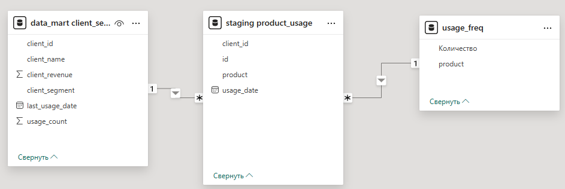
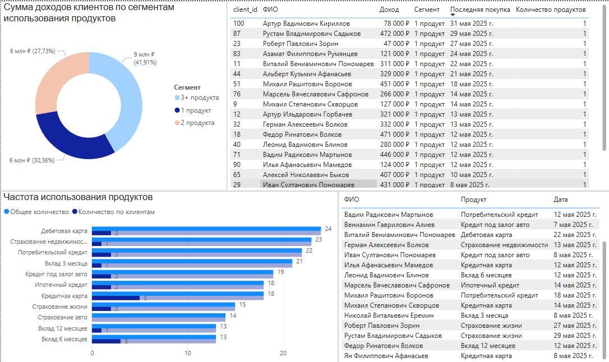
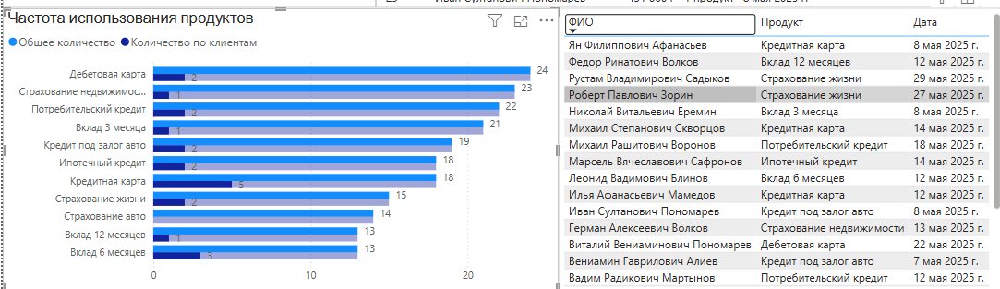

# ETL процесс для сегментации клиентов по использованию банковских продуктов

## Описание проекта

Этот проект демонстрирует процесс построения аналитической витрины клиентов банка — от генерации синтетических данных до загрузки и визуализации в Power BI.  
В процессе ETL данные проходят через слои: `staging` → `data_mart` → Power BI.

База данных состоит из слоев:
- `staging`
- `data_mart`

В результате строится витрина, содержащая сегментированных клиентов на основе их активности.  
Запуск системы осуществляется в командной строке.

### Цель сегментации:
Сегментация клиентов по количеству используемых продуктов отражает уровень их вовлеченности:
- **1 продукт** - минимальная вовлеченность, клиент попробовал сервис, потенциально может уйти (отток).
- **2 продукта** - средняя вовлеченность, потенциальный клиент для кросс-продаж.
- **3+ продуктов** - лояльный клиент, важно удержание.

Такой подход позволяет:
- Выявлять аудиторию для маркетинговых компаний.
- Определять приоритетные сегменты для роста LTV (долгосрочной ценности клиента).
- Отслеживать риск оттока.

### Гипотезы для аналитики:
  На основе витрины можно проверить различные бизнес-гипотезы:
  - **Гипотеза 1:** клиенты с 1 продуктом - это потенциально неактивные пользователи (высокий риск оттока).
  - **Гипотеза 2:** возможность повышения эффективности кросс-продаж путем предложения релеватных услуг (например, дебетовая карта + вклад).
  - **Гипотеза 3:** уровень дохода влияет на количество используемых продуктов (чем выше доход - тем выше вовлеченность).
---

## Используемый стек

### Бэкенд
- Python 3.12+
- PostgreSQL

### Библиотеки
- SQLAlchemy
- pandas
- python-dotenv
- logging

### Инструменты
- Power BI (для визуализации)

---

## Исходные данные

Исходные данные передаются в `.jsonl` файлах:
- `names.jsonl` — данные по именам  
- `midnames.jsonl` — данные по отчествам  
- `surnames.jsonl` — данные по фамилиям

---

## Установка и запуск

### 1. Клонировать проект:
```bash
git clone <метод копирования>
```

Будут скопированы 3 рабочих файла:
- `main.py` — основной скрипт запуска ETL
- `database.py` — работа с БД, содержит класс `DBExtractor` (создание таблиц, загрузка, извлечение данных)
- `DataGeneration.py` — генерация тестовых данных

### 2. Установить зависимости:
```bash
pip install -r requirements.txt
```

### 3. Создать файл `.env`:
```bash
touch .env
```

В `.env` прописать параметры подключения и пути к файлам:
```env
DB_HOST=localhost
DB_PORT=5432
DB_NAME=league
DB_USER=myuser
DB_PASS=...

PATH_NAMES=etl/Database/jsonl/names_table.jsonl
PATH_MIDNAMES=etl/Database/jsonl/midnames_table.jsonl
PATH_SURNAMES=etl/Database/jsonl/surnames_table.jsonl
PATH_CLIENTS=etl/Database/csv/Инд. проект/clients.csv
PATH_USAGE=etl/Database/csv/product_usage.csv
```

### 4. Запустить систему:
```bash
python main.py
```

---

## Компоненты ETL-процесса

### Генерация данных

`DataGeneration.py` — модуль для создания синтетических данных клиентов банка и их продуктов.  
Данные генерируются с использованием имен с частотой выше 5000.

#### 1. Генерация клиентов:
- Реалистичные ФИО с учетом гендера  
- Случайная величина дохода (30 000 – 500 000 руб.)  
- Сохранение в CSV (`clients.csv`)

#### 2. Генерация использования продуктов:
- 11 случайных финансовых продуктов (кредиты, вклады, карты, страхование)  
- Случайные даты операций (май 2025)  
- Сохранение в CSV (`product_usage.csv`)

#### Использование:
```python
generator = DataGenerator()
generator.generate_clients()
generator.generate_product_usage()
```

---

### ETL-ядро

`database.py` — модуль для работы с базой данных PostgreSQL, реализующий ETL-процесс.  
Происходит загрузка данных из CSV на слой `staging`, агрегация и загрузка в `data_mart`.

#### 1. Инициализация:
Создает соединение с PostgreSQL, используя `.env`.

#### 2. Основные методы:
- `seq_restart()` — сбрасывает sequence ID перед новой загрузкой  
- `reading_file()` — базовое чтение CSV  
- `loading_clients()` — загрузка клиентов в `staging.clients`  
- `loading_usage()` — загрузка продуктов в `staging.product_usage`  
- `load_datamart()` — загрузка агрегатов в `data_mart.client_segments`

#### 3. Работа со структурой БД:
- `create_table()` — создает таблицы, если не существуют: `staging.clients`, `staging.product_usage`, `data_mart.client_segments`

#### 4. SQL-операции:
- `load_sql()` — загрузка SQL из файла  
- `fetch_df()` — выполнение SQL и возврат `DataFrame`  
- `fetch_clients_segmentation()` — получение сегментированных клиентов

#### 5. Пример использования:
```python
extractor = DBExtractor()

# Создание таблиц
extractor.create_table('clients')
extractor.create_table('product_usage')
extractor.create_table('client_segments')

# Сброс последовательностей
extractor.seq_restart('staging.clients_id_seq')
extractor.seq_restart('staging.usage_id_seq')

# Загрузка данных
extractor.reading_file(os.path.join(CSV_DIR, "clients.csv"), extractor.loading_clients)
extractor.reading_file(os.path.join(CSV_DIR, "product_usage.csv"), extractor.loading_usage)

# Получение и загрузка агрегатов
df_client_segments = extractor.fetch_clients_segmentation()
extractor.load_datamart(df_client_segments, 'data_mart', 'client_segments')
```

---

## Слой с аналитической витриной

Этот слой — результат ETL, откуда Power BI получает данные.

Агрегируются данные по каждому клиенту и присваивается сегмент на основе количества использованных продуктов.

### Структура витрины:

| Поле                     | Тип данных | Описание                                          |
|--------------------------|------------|--------------------------------------------------|
| `client_id`              | INTEGER    | Идентификатор клиента                             |
| `client_name`            | VARCHAR    | Полное имя клиента                                |
| `client_revenue`         | INTEGER    | Доход клиента, ₽                                  |
| `usage_count`            | INTEGER    | Кол-во использованных продуктов                   |
| `client_segment`         | VARCHAR    | Название сегмента                                 |
| `last_product_usage_date`| DATE       | Дата последнего использования продукта            |

### Примеры сегментов:
- 1 продукт  
- 2 продукта  
- 3+ продуктов

### Пример записи:
```csv
client_id,client_name,client_revenue,usage_count,client_segment,last_product_usage_date
83,Азамат Филиппович Румянцев,121000,1,1 продукт,2025-05-24
```

---

## Демонстрация отчета

### Источник данных
Power BI напрямую подключается к Базе данных PostgreSQL. Основной источник - таблица `data_mart.client_segments`. Дополнительно используется таблица `staging.product_usage` и вспомогательная таблица, созданная средствами Power Query (`usage_freq`)

### Модель данных

Используются таблицы:
- `data_mart.client_segments` — основная витрина по клиентам.
- `staging.product_usage` — для детализации по типам продуктов.
- `usage_freq`(Power Query) — Частота использования продуктов.

В модели установлены связи по `client_id`, обеспечена фильтрация от витрины к детализации.

Модель:


### Визуализация и метрики


#### Диаграмм сегментов клиентов (Pie Chart)
- Поля: `client_segment`, `client_id`(count).
- Цель: выявить доли клиентов по вовлеченности (1, 2, 3+ продуктов).

#### Топ популярных продуктов (Bar Chart)
- Поля: `product_name`, `usage_id`(count).
- Фильтр: выбирается сегмент "1 продукт".
- Сортировка: по убыванию количества.

#### Д

#### Информация о клиентах
- Поля:
  -  Доход (`client_revenue`).
  -  Последний продукт и дата использования (`last_product_usage_date`).
  -  Сегмент
  -  `usage_id`(count).
- Фильтры: `client_name`.

#### Применение в бизнес-задачах
- **Сегментация для маркетинга** - выбор группы "1 продукт" для целевой маркетинговой кампании.
- **Анализ интересов** - какие продукты наиболее популярны в сегменте.
- **Кросс-продажи** - какие продукты предложить клиенту на основе поведения сегмента(группы).
- **Мониторинг вовлеченности** - оценка изменений в разрезе месяцев (при добавлении динамики).
---

## Пример анализа

Одна из целей отчета — предложить кампанию для клиентов с 1 продуктом.

### 1. Выявление клиентов с 1 продуктом:
На круговой диаграмме выбрать сегмент "1 продукт" (синим цветом):  


### 2. Анализ популярных продуктов:
По линейчатой диаграмме — топ-3:
- Кредитная карта (5 клиентов)
- Вклад 6 мес. (3 клиента)
- Дебетовая карта (2 клиента)

При равной частоте — сортировать по убыванию "Общего количества".

### 3. Пример персонального предложения:
Клиент: **Роберт Павлович Зорин**  
Он пользовался только "Страхование жизни".  
Предложение: "Кредитная карта" — популярный продукт в его сегменте.  


---

## Системная аналитика
В рамках проекта реализован не только ETL, но и базовая системная аналитика. Ниже представлены основные требования и процессы, вытекающие из бизнес-задачи сегментации клиентов.

### 1. Бизнес требование: сегментировать клиентов по активности
**Функциональные требования:**
- Загрузить информацию о клиентах и их активности в БД.
- Подсчитать количество продуктов на клиента.
- Сформировать витрину с необходимыми атрибутами (доход, имя, последняя дата, сегмент и т.д.).
- Обеспечить доступность данных для Power BI.

**Нефункциональные требования**
- Идемпотентность загрузки: возможность повторной загрузки данных без дублирования (в т.ч. сброс sequence)
- Масштабируемость: поддержка обработки больших объемов клиентов без ухудшения производительности
- Надежность: обработка ошибок при чтении/записи и логирование этапов.

### 2. Описание потоков данных
**Источник данных:**
- `JSONL, CSV`: входные данные.
- `Power BI`: выходная визуализация.

**Промежуточные слои**
- `staging`: хранение сырых данных.
- `data_mart`: агрегированная аналитика.

### 3. Основные сущности
- `clients`: содержит информацию о ФИО и доходе.
- `product_usage`: содержит информацию об операциях с продуктами.
- `client_segments`: итоговая аналитическая таблица.

### 4. Роль аналитика в проекте
- Описание структуры хранимых данных.
- Формирование требований к итоговой витрине.
- Формирование логики сегментации (группировка, фильтрация).
- Передача требований разработчику (или реализация ETL самостоятельно).
- Построение и описание модели данных в Power BI.
---
## Цели проекта

Проект создан в учебных целях — это практическое задание в рамках стажировки.
